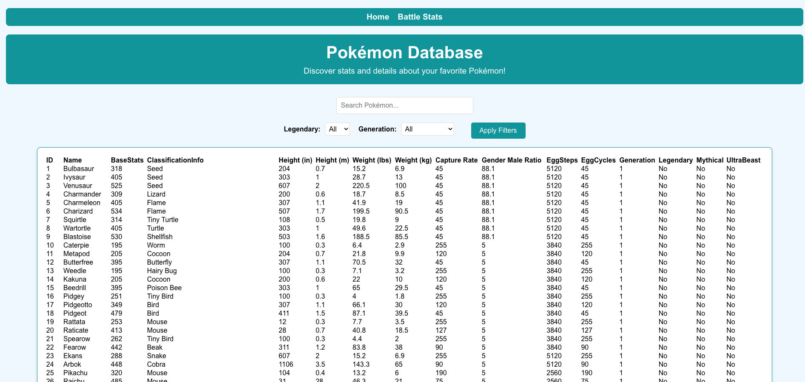
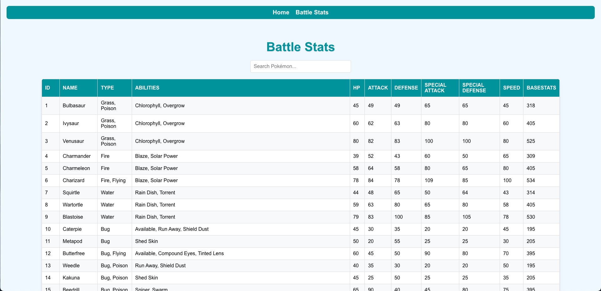

## Pokemon Project
This is a full-stack application that features a React-based frontend and a Node.js-based backend API. The project is structured as a monorepo, with the frontend and backend living in separate directories under a single main repository.

This is catalog of all 1,025 Pokémon species, battle stats, and their details. You can organize the pokemon by Base Stats, Classification Info, Height(in), Height(m), Weight(lbs),	Weight(kg), Capture Rate, Gender Male Ratio, EggSteps, EggCycles, Generation, Legendary, Mythical, and UltraBeast.

## Features
Frontend: A user interface built with React to interact with the Pokemon data.
Backend: A RESTful API built with Node.js to handle data requests.
Database: Persistent storage for Pokemon data using a MySQL database.

## Technologies Used

### Frontend
- React
- Node.js (for package management)
- npm

### Backend
- Node.js / Express
- MySQL

## Prerequisites
Before you can run this project, you must have the following software installed on your machine:

Node.js & npm: You can download these from nodejs.org.

A MySQL server: The backend is configured to connect to a MySQL database running on localhost:3306. You can install a MySQL server using a tool like XAMPP, MAMP, or by following the official MySQL installation guide.

